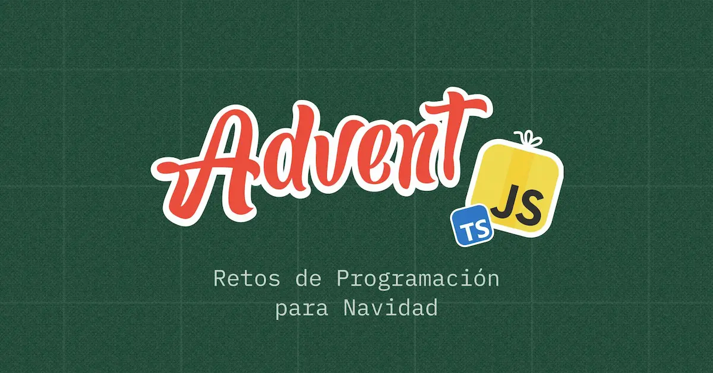

# 👩🏻‍💻 Advent JS 2024  

Mis soluciones a los desafíos de **[AdventJS](https://adventjs.dev)**, el conjunto de retos para practicar tu lógica de programación lanzados a lo largo del mes de Diciembre de 2024 por [Miguel Ángel Durán _"midudev"_](https://midu.dev).

> [!IMPORTANT]  
> **Retos Completados:** 11 de 12 ✅  
> **Estrellas Conseguidas** _(contando solo las de JavaScript)_: 51 de 60 ✅

## Soluciones

| #   | Título del Desafío                 | Instrucciones         | Soluciones                             |
| --- | ---------------------------------- | --------------------- | -------------------------------------- |
| 01  | 🎁 ¡Primer regalo repetido!        | [📄](01/README_01.md) | [🟡](01/01.js)(**5**⭐) [🔵](01/01.ts) |
| 02  | 🖼 Enmarcando nombres               | [📄](02/README_02.md) | [🟡](02/02.js)(**5**⭐) [🔵](02/02.ts) |
| 03  | 🏗️ Organizando el inventario       | [📄](03/README_03.md) | [🟡](03/03.js)(**5**⭐) [🔵](03/03.ts) |
| 04  | 🎄 Decorando el árbol de Navidad   | [📄](04/README_04.md) | [🟡](04/04.js)(**5**⭐) [🔵](04/04.ts) |
| 05  | 👞 Emparejando botas               | [📄](05/README_05.md) | [🟡](05/05.js)(**5**⭐) [🔵](05/05.ts) |
| 06  | 📦 ¿Regalo dentro de la caja?      | [📄](06/README_06.md) | [🟡](06/06.js)(**5**⭐) [🔵](06/06.ts) |
| 07  | 👹 El ataque del Grinch            | [📄](07/README_07.md) | [🟡](07/07.js)(**5**⭐) [🔵](07/07.ts) |
| 08  | 🦌 La carrera de renos             | [📄](08/README_08.md) | [🟡](08/08.js)(**5**⭐) [🔵](08/08.ts) |
| 09  | 🚂 El tren mágico                  | [📄](09/README_09.md) | [🟡](09/09.js)(3⭐) [🔵](09/09.ts)     |
| 10  | 👩‍💻 El ensamblador élfico           | [📄](10/README_10.md) | [🟡](10/10.js)(3⭐) [🔵](10/10.ts)     |
| 11  | 🏴‍☠️ Nombres de archivos codificados | [📄](11/README_11.md) | [🟡](11/11.js)(**5**⭐) [🔵](11/11.ts) |
| 12  |                                    |                       |                                        |
| 13  |                                    |                       |                                        |
| 14  |                                    |                       |                                        |
| 15  |                                    |                       |                                        |
| 16  |                                    |                       |                                        |
| 17  |                                    |                       |                                        |
| 18  |                                    |                       |                                        |
| 19  |                                    |                       |                                        |
| 20  |                                    |                       |                                        |
| 21  |                                    |                       |                                        |
| 22  |                                    |                       |                                        |
| 23  |                                    |                       |                                        |
| 24  |                                    |                       |                                        |

## Changelog

_(\* no incluyendo actualizaciones diarias)_

- **12 Dic 2024** - Puesta al día de retos, añadidas estrellas en cada reto
- **4 Dic 2024** - Refactorizada solución reto 3 (conseguidas las cinco estrellas!), corregido detalle del reto 4
- **1 Dic 2024** - Iniciado el repo, subida la solución del reto 1 en JavaScript y TypeScript
